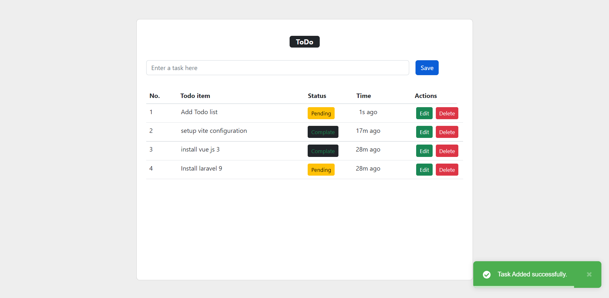

# Laravel vue Todo

Todo list using Laravel 9 vue3 composition api and compile assets using vite  

## Screenshots




## Roadmap

- Clone the project
- Setup env
- Install dependencies 
- Start the server 
## Run Locally

Clone the project

```bash
  git clone https://github.com/rahulvadhavani/laravel9vue-todo.git
```

Go to the project directory

```bash
  cd my-project
```

Setup env 

```bash
  DB_DATABASE="DBname"
```

Install dependencies

```bash
  composer install
  npm install
```

Start the server

```bash
  npm run dev
  php artisan serve
```


## Usage/Examples

### create New projects project
```javascript
import Component from 'my-project'

function App() {
  return <Component />
}
```

